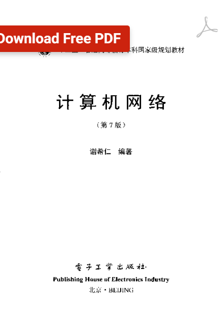

# 相关书籍推荐

初级：

<figure><figcaption>
图解硬件，TCP/IP，HTTP
</figcaption></figure>

中级：

<figure><figcaption>
计算机网络
</figcaption></figure>

高级：&#x20;

<figure><figcaption>
计算机网络
</figcaption></figure>

 

<figure><figcaption>
TCP/IP详解
</figcaption></figure>

