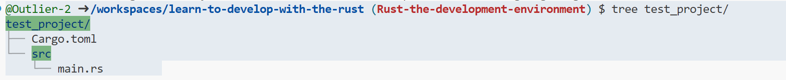

# 🚀 入门例子

## Hello World (在此不过多介绍)


Hello World！！！


## Create a new bin project

```bash
cargo new project_name # default create bin projcet
```

<figure><figcaption><p>tree command see project</p></figcaption></figure>

当你使用 `cargo new` 创建一个新的 Rust 项目时，Cargo 会为你生成一个标准的项目结构。对于一个二进制项目（`bin` 项目），创建后项目目录通常包含以下文件和目录：

#### 项目结构

```bash
test_project/
├── Cargo.toml
└── src/
    └── main.rs
```

#### 文件和目录介绍

1.  **`Cargo.toml`**

    `Cargo.toml` 是项目的配置文件，包含了项目的元数据、依赖项、构建配置等内容。以下是 `Cargo.toml` 文件的典型内容：

    ```toml
    [package]
    name = "my_project"
    version = "0.1.0"
    edition = "2021"

    # 依赖项
    [dependencies]
    ```

    * **`[package]`**：定义包的元数据，包括包的名称、版本号和 Rust 语言的 edition（如 2018 或 2021）。
    * **`[dependencies]`**：列出项目所需的依赖库。如果你需要使用第三方库，可以在这里添加，例如 `serde = "1.0"`。
2.  **`src/`**

    `src` 目录是项目的源代码目录。对于一个二进制项目，Cargo 默认会生成一个 `main.rs` 文件作为程序的入口。
3.  **`src/main.rs`**

    `main.rs` 是项目的主文件，包含程序的入口函数 `main()`。这是一个简单的示例：

    ```rust
    fn main() {
        println!("Hello, world!");
    }
    ```

    * **`fn main()`**：程序的入口函数，当你运行 `cargo run` 时，`main()` 函数会被调用。`main.rs` 中的代码就是程序的核心逻辑。

#### 运行与构建

当你创建了一个新的 `bin` 项目后，可以通过以下命令来运行和构建项目：

* **`cargo run`**：编译并运行项目，执行 `main.rs` 中的代码。
* **`cargo build`**：编译项目，生成二进制文件（默认存放在 `target/debug/` 目录中）。
* **`cargo build --release`**：编译发布版本，进行优化并生成二进制文件（默认存放在 `target/release/` 目录中）。

当你使用 `cargo new --lib` 创建一个新的 Rust 库项目时，Cargo 会生成一个适合编写 Rust 库的项目结构。与二进制项目（`bin`）不同，库项目（`lib`）的核心在于编写可以被其他项目或应用程序调用和复用的代码。

#### 项目结构

```css
my_library/
├── Cargo.toml
└── src/
    └── lib.rs
```

#### 文件和目录介绍

1.  **`Cargo.toml`**

    `Cargo.toml` 是项目的配置文件，包含库项目的元数据、依赖项、构建配置等内容。以下是库项目的 `Cargo.toml` 文件的典型内容：

    ```toml
    [package]
    name = "my_library"
    version = "0.1.0"
    edition = "2021"

    # 依赖项
    [dependencies]
    ```

    * **`[package]`**：定义库的元数据，包括库的名称、版本号和 Rust 语言的 edition。
    * **`[dependencies]`**：列出项目所需的依赖库。你可以在这里添加第三方库或工具，例如 `rand = "0.8"`。
2.  **`src/`**

    `src` 目录是项目的源代码目录。对于一个库项目，Cargo 默认会生成一个 `lib.rs` 文件作为库的入口。
3.  **`src/lib.rs`**

    `lib.rs` 是库项目的主文件，定义了库的模块、公共 API 以及其他逻辑。这是一个简单的示例：// 定义库的公共 API

    ```rust
    pub fn hello() -> String {
        "Hello, library!".to_string()
    }
    ```

    * **`pub fn hello()`**：这是一个公共函数，可以被其他项目调用。`pub` 关键字表示这个函数是公开的，可以被库的用户访问。
    * 在 `lib.rs` 中，你可以定义多个模块、结构体、枚举、函数等来实现库的功能。

#### 使用库项目

创建一个库项目后，你可以通过以下方式使用和测试它：

*   **在其他项目中使用**：你可以在其他 Rust 项目中通过在 `Cargo.toml` 中添加依赖项来引用这个库。例如：

    ```toml
    [dependencies]
    my_library = { path = "../my_library" }
    ```
*   **测试库功能**：通过在 `src/lib.rs` 中添加测试模块来测试库的功能：

    ```rust
    #[cfg(test)]
    mod tests {
        use super::*;

        #[test]
        fn test_hello() {
            assert_eq!(hello(), "Hello, library!");
        }
    }
    ```
* **编译库**：使用 `cargo build` 或 `cargo build --release` 编译库项目，生成 `.rlib` 文件，这些文件可以被其他 Rust 项目链接和使用。

